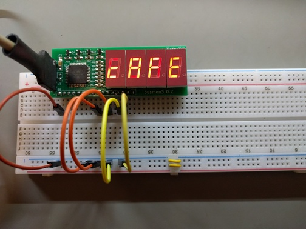

# busmon3: Breadboard-friendly 16 bit hex display

`busmon3` is a 16 bit hex display designed to plug into standard 830 contact solderless breadboards.  It's useful for microcomputer projects and similar because it allows you to see the value being driven on a 16 bit bus.

Obligatory action shot (click for full size):

I got the idea from Quinn Dunki's [HexOut](http://quinndunki.com/blondihacks/?p=610) project.

The design is fairly brute force, but it does work.  The TQFN44 package of the atmega164a has 0.8mm pitch, which isn't too bad to hand-solder.  I have ordered boards from both [OSHPark](https://oshpark.com/) and [Seeed Studio](https://www.seeedstudio.com/fusion_pcb.html) and they work fine.

Note that the data inputs are pulled high (to VCC) by the atmega164a's internal pullup resistors.  You could change this in the firmware if you felt like it (e.g., because your bus already has external pullup or pulldown resistors.)

Also note that the board (1) is designed to sit at the top of an 830 contact breadboard, (2) assumes that VCC are GND are available on the breadboard's bus strips, and (3) assumes that the bottom bus strip is VCC.

# Parts needed

* atmega164a (TQFN44 package)
* 4 DIP14 package common anode 7 segment LED displays (MAN3620A, LTS-4910AHR, or similar)
* 4 SOT-23 MMBT3906 transistors
* 1 0.1uF 0805 ceramic capacitor (for decoupling)
* 7 270 Ohm 0805 resistors (the schematic shows 330 Ohm, but the displays are driven at 1/4 duty)
* 4 4.7K Ohm 0805 resistors
* 2 pin 0.1" male pin header (for breadboard power connections)
* 6 pin 0.1" male pin header (AVR programming header)
* 16 pin 0.1" male pin header (for breadboard data connections)

You will need an AVR programmer to program the firmware to the atmega164a.

# License

All material is copyright (c) 2017–2019, [David Hovemeyer](mailto:david.hovemeyer@gmail.com).

The hardware design is made available under the [CERN Open Hardware License version 1.2](https://www.ohwr.org/project/cernohl/uploads/505f27c2a8a10e528b079be3c9d876c5/cern_ohl_v_1_2.txt).

The firmware is made available under the [MIT License](https://opensource.org/licenses/MIT).
